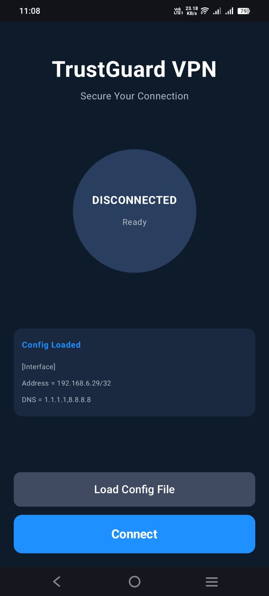
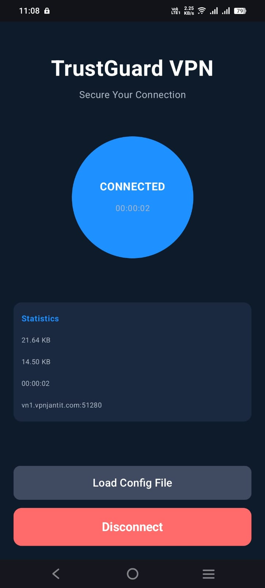

# TrustGuard VPN
A secure and lightweight Android VPN built with Kotlin, WireGuard, and Hilt.

TrustGuard focuses on fast connections, clean architecture, and real-time usage tracking. It uses the WireGuard backend for encryption and routing, with a modern Jetpack-based UI.

## Screenshots
These images are loaded from the `screenshots/` folder.

<p align="center">
  
  
</p>

## Features
### Secure VPN
- Built on WireGuard for fast and reliable tunneling
- Automatic reconnect and error handling
- Strong encryption and low battery usage

### Modern Android Stack
- Kotlin
- Hilt for dependency injection
- Coroutines and Flows
- Jetpack libraries for lifecycle and state
- Clean and simple UI

### Live Traffic Monitoring
Tracks usage while VPN is active:
- Upload and download
- Current speed
- Session usage
- Connection duration
- Real-time updates

### Architecture
- Clean architecture
- Repository pattern
- Flow‑based tracking
- Service‑based WireGuard management

### Core Modules
- WireGuardVpnService
- VpnRepository
- VpnViewModel
- Hilt Modules

## How It Works
1. Load or select a WireGuard config
2. App creates a tunnel using GoBackend
3. Service listens to peer stats
4. Stats stream to UI through Flows
5. UI shows usage and connection time
6. Disconnect clears session data

## Requirements
- Android 8.0+
- VPN permission
- WireGuard userspace support

## Setup & Build
Clone the project:
```
git clone https://github.com/yourusername/TrustGuard-VPN.git
```

Build and run:
```
./gradlew assembleDebug
```

## Roadmap
- Kill switch
- Always‑on mode
- Server selection
- Config backend API
- Usage history
- Themes

## License
Add your preferred license.
